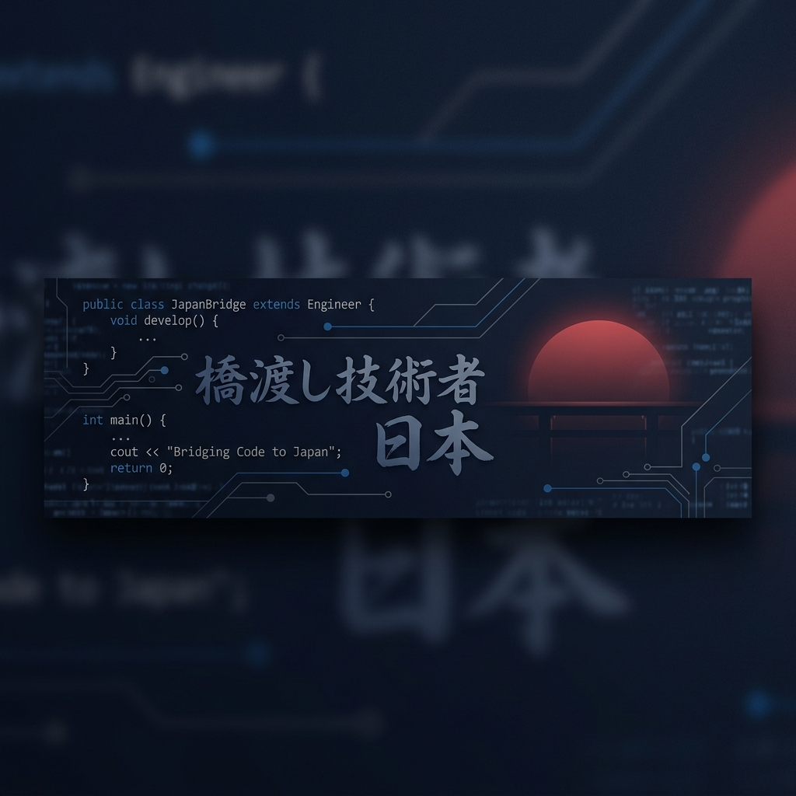

# こんにちは, I'm Sỳ Chí Khởi (Molten) 👋
### 🎓 Software Engineering Freshman | Future Bridge Software Engineer (BrSE)

  
  
  

---

### 📖 About My Journey
I am a first-year **Software Engineering** student currently building a rock-solid foundation in Computer Science. My dream is to become a **Bridge Software Engineer (BrSE)**, serving as a technical and cultural link between Vietnam and Japan. 

As a freshman, I am not just learning to code; I am learning to think, solve problems, and communicate effectively across borders.

- 🇯🇵 **Language Target:** Currently mastering Japanese basics (Aiming for N5/N4).
- 💻 **Tech Focus:** Mastering **C** for logic and **Java** for Object-Oriented thinking.
- 🌱 **Philosophy:** "Slow is smooth, and smooth is fast." – focusing on the quality of fundamentals over the quantity of technologies.

---

### 🗺️ 2024 - 2025 Learning Roadmap
- [x] Master basic C syntax & Logic
- [/] Deep dive into Data Structures & Algorithms (C)
- [/] Master OOP Principles (Java)
- [ ] Achieve Japanese N4 Level
- [ ] Complete first personal portfolio project

---

### 🛠️ Tech Stack & Skills

  
  
  
  

---

### 🌟 Current Focus Repositories

#### 🏗️ [OOPTour](https://github.com/Molten-2168/OOPTour)
> **Mastering Java & OOP Principles.**
> My journey into clean code and design paradigms. Even as a freshman, I aim to write code that is professional and maintainable.

#### 🧠 [Data-Structure-Algorithm](https://github.com/Molten-2168/Data-Structure-Algorithm)
> **The Logic Lab (C Language).**
> Where I sharpen my problem-solving skills. I use C to understand how memory and data work at a fundamental level.

---

### 📊 GitHub Activity

  

---

### 🤝 Connect with Me

  
  

*"Building the bridge, one line of code at a time."*
